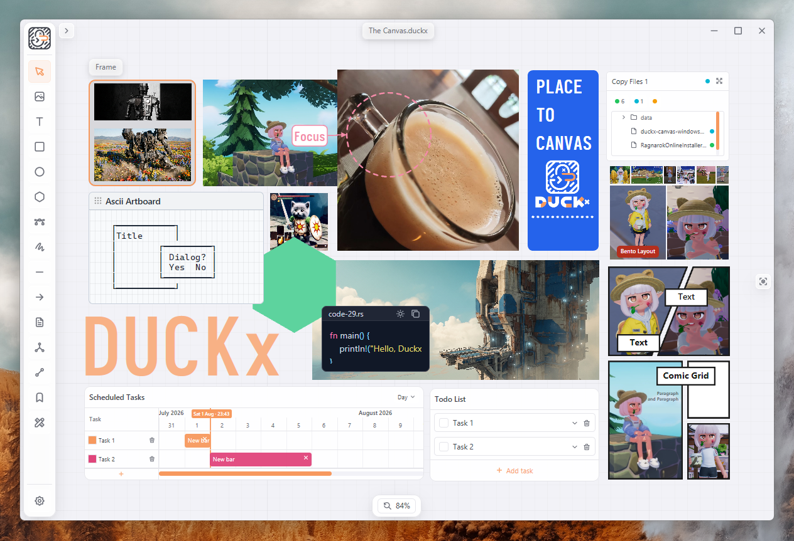

# 🎨 Duckx Canvas

**Duckx Canvas** is a high-performance, GPU-accelerated infinite canvas and graphic editor. Built with **Rust** and powered by **GPUI** (the modern GPU-accelerated UI framework from the creators of Zed Editor), Duckx Canvas is designed to be lightweight, responsive, and aesthetically stunning.

The application follows the **Floating Island UI** design concept, providing a premium, clutter-free user experience with mathematically symmetrical nesting layout structures.
### Source incoming
---

## ✨ Key Features

### 🚀 1. GPU-Accelerated Infinite Canvas
*   **Infinite Panning & Zooming:** Seamless navigation across a limitless board with zero performance degradation.
*   **Lyon Path Tessellation:** High-performance vector graphic rendering for complex shapes.
*   **Workspace Grid:** Optional major/minor grid overlay for alignment while you work.

### 📦 2. Comprehensive Object Model
*   **Images (`ImageObject`):** Drop image files (`png`, `jpg`, `jpeg`, `webp`, `gif`, `bmp`, `ico`) onto the canvas. Support for placing multiple files laid out in an automatic Flexbox grid, scaling with locked aspect ratios, and quantized rotation with image cache optimization.
*   **SVG & Emoji:** Place Tabler icons (outline/filled), custom SVGs, and emoji from the Assets panel — or drop SVG files straight onto the canvas.
*   **Rich Text (`TextObject`):** Customizable text boxes with custom fonts, colors, border styles (solid or dashed), and margins/paddings that dynamically scale relative to the canvas zoom level.
*   **Code Blocks (`CodeBlockObject`):** Insert code snippets with built-in syntax highlighting, customized monospace font support, and line-by-line scrolling.
*   **Live Markdown (`MarkdownObject`):** Write and render formatted Markdown documents side-by-side directly on the infinite canvas.
*   **Bookmark Cards (`BookmarkObject`):** Create visual links and bookmark boxes that resize dynamically to fit their labels, with a jump list for quick navigation.
*   **Grouping Frames (`FrameObject`):** Create visual boundaries to organize, group, and align objects. Supports nesting, importing external frames, and sync workflows (**Append** / **Update from** / **Update to**).
*   **Object Links:** Connect two objects with a link tool, and embed hyperlinks on objects for external references.
*   **Shapes & Vector Art:**
    *   *Rectangle:* Corner rounding (radius) and dashed border adjustments.
    *   *Circle/Ellipse:* Customizable circle bounds and properties.
    *   *Polygon:* Adjust the number of sides dynamically from 3 to 64.
    *   *Lines & Arrows:* Draw lines with dashed options and toggle start/end arrowheads.
    *   *Draw/Ink:* Draw freehand sketches using custom pencil/brush colors, thickness, and eraser modes.

### 📋 3. Utility Objects
*   **Todo List:** Interactive checklists on the canvas — tasks with details, reorder, and copy/paste of list data.
*   **Scheduled Tasks:** Timeline-style task bars for planning work visually on the board.
*   **Ascii Artboard:** Full ASCII grid editor (pen, eraser, eyedropper, text, line, rect, fill, table, tree) with light/heavy/double box drawing and one-click copy for the terminal.
*   **Comic Grid:** Manga/comic panel layouts with Object/Edit modes, knife split, in-panel image transform, and Quick Text.
*   **Copy Files:** FROM→TO file-copy widgets with scan/copy flows; on Windows, TortoiseSVN integration from the context menu.

### 🖼️ 4. Image Workflow Tools
*   **Crop & Flip:** Crop images in a dedicated modal; flip horizontally or vertically with async progress feedback.
*   **Extract Text (OCR):** Local OCR via `ocrs` to pull text out of images (models cached on first use).
*   **Bento Grid:** Auto-arrange two or more selected images into a balanced bento layout.
*   **Rectangle from Bounds:** Generate a padded outline rectangle from an image’s bounds.
*   **Quick Look:** Press `Space` to preview selected images.
*   **Picture-in-Picture (PIP):** Float an image in a topmost OS window (On/Off, Lock, Reset).
*   **Copy Image / Save To…:** Copy pixel data to the clipboard or export to a chosen path from the context menu.

### 🛠️ 5. Advanced Editing & Selection Tools
*   **Vector Path Editor:** Toggle edit mode to modify Bezier paths directly. Add/delete anchors, manipulate control handles, and round specific corners using the round-corner tool.
*   **Interactive Transform:** Select multiple items, scale, and rotate objects with real-time feedback. Maintain original aspect ratios by holding `Shift`.
*   **Z-Order Controls:** Bring to Front / Forward / Send Backward / Back from the context menu.
*   **Find:** Search text objects on the canvas with `Ctrl/Cmd+F`.
*   **Style Clipboard:** Copy and paste styles between objects (`Ctrl/Cmd+Alt+C` / `V`), with Style Presets, recent styles per tool, and “Objects with Same Style” selection.
*   **Global Screen Eyedropper:** Sample any color pixel from your screen globally and apply it instantly to canvas fills, strokes, or theme presets.
*   **Undo / Redo:** Full history stack (`Ctrl/Cmd+Z`, `Ctrl/Cmd+Shift+Z` / `Y`).

### 🤖 6. AI Translate
*   **Local AI Providers:** Connect to **Ollama** or **LM Studio** (OpenAI-compatible) — no API key required.
*   **Translate Text & Markdown:** Context-menu Translate flow with language pair, model picker, think mode, and max-token controls.
*   Configure base URLs under **Settings → AI Providers**.

### 🎨 7. Theme Engine & Modern Design Language
*   **Floating Island UI:** Floating menus, toolbars, property editors, and dialogs with smooth drop shadows.
*   **Assets Panel:** Browse and place from **Assets**, **SVG**, and **Emoji** tabs without leaving the canvas.
*   **Theme Catalog & Customization:** Instantly switch between presets like `Duckx Light`, `Duckx Dark`, and `Catppuccin Mocha`. Fine-tune specific color or layout parameters using live sliders directly within Settings.
*   **Nested Curves Rule:** Ensures mathematical visual balance across components following the formula:
    $$R_{\text{outer}} = R_{\text{inner}} + \text{gap}$$

### 💾 8. Native Save Format (`.duckx`)
*   Saves workspaces in a structured, compressed zip package storing the Canvas state, local fonts, configurations, and extracted image assets in one portable file.
*   Drop a `.duckx` file onto the canvas or use Open to load a workspace.
*   **Auto-Updates:** Checks GitHub Releases for newer builds from Settings → Updates.

### 🧩 9. Node-Based Compositing Editor
*   **Visual Node Graph:** Place and wire up processing nodes directly on the infinite canvas. Drag connections between input/output sockets, with wired values always overriding a node's own body fields, and multi-input sockets (rendered as squares) that accept more than one incoming connection.
*   **Image Processing Nodes:** `Image Input`/`Image Output` (with live preview and optional auto-save), `Channels` (split/combine RGBA), `Resize Image`, `RGB` (constant colour source with a live swatch), `HSL`, `Levels`, `Threshold`, `Filters` (Emboss, Box/Gaussian Blur, Sharpen, Sobel, Laplace, Prewitt, Noise Reduction, Edge One/Detection), `Invert`, `Blending Effect` (12 photon-rs blend modes), and `Mix` (uniform factor blend or per-pixel image-mask blend, à la Blender's Mix node).
*   **Math & Utility Nodes:** `Math` (add/subtract/multiply/divide), `Vector XY`, `Sum` (totals any number of connected values), `Logic Node`, and `Node Group`.
*   **Incremental Graph Evaluation:** A topologically scheduled, cache-invalidated engine recomputes only the affected subgraph on each change, with background-threaded preview baking for `Image Output` sinks.
*   Node graphs are saved and restored as part of the native `.duckx` format.

### ⌨️ 10. Keyboard Shortcuts

| Shortcut | Action |
|----------|--------|
| `V` `I` `T` `R` `E` `H` `P` `N` `L` `A` `C` `M` `B` | Select, Image, Text, Rect, Ellipse, Polygon, Path, Draw, Line, Arrow, Code, Markdown, Bookmark |
| `Ctrl/Cmd+Z` / `Shift+Z` / `Y` | Undo / Redo |
| `Ctrl/Cmd+S` / `O` | Save / Open |
| `Ctrl/Cmd+C` / `V` | Copy / Paste objects |
| `Ctrl/Cmd+Alt+C` / `V` | Copy / Paste style |
| `Ctrl/Cmd+F` | Find |
| `F` | Focus viewport on selection |
| `Space` | Quick Look (images) |
| `Delete` / `Backspace` / `X` | Delete |
| `Shift` (gestures) | Constrain aspect / snap |
| `Esc` | Cancel drafts / close modals |

---

## 🛠️ Technology Stack

*   **Rust** (Edition 2021)
*   **GPUI** — UI and Graphics windowing system from Zed Industries.
*   **Lyon** — 2D vector path rendering and tessellation.
*   **Photon-rs & Image** — Image loading and processing utilities.
*   **ocrs / rten** — On-device OCR for Extract Text.
*   **ollama-rs & reqwest** — Local AI provider clients for Translate.
*   **RFD (Rust File Dialogs)** — System native file pickers.
*   **Windows Sys** — Low-level OS window behavior integrations (Topmost, Click-through, Focus).


---

## 📥 Installation

You can install Duckx Canvas instantly using our one-line installer scripts.

### 🪟 Windows (via PowerShell or curl)
Open PowerShell and run:
```powershell
irm https://raw.githubusercontent.com/Manuree/Duckx-Canvas/main/install.ps1 | iex
```
*Or via standard cmd/git-bash using curl:*
```cmd
curl.exe -sSfL https://raw.githubusercontent.com/Manuree/Duckx-Canvas/main/install.ps1 -o install.ps1 && powershell -ExecutionPolicy Bypass -File install.ps1 && del install.ps1
```

### 🍎 macOS / 🐧 Linux
```bash
curl -sSfL https://raw.githubusercontent.com/Manuree/Duckx-Canvas/main/install.sh | bash
```
*macOS:* universal binary zip · *Linux:* `x86_64` tar.gz from GitHub Releases.

### 🔧 Build from Source
```bash
cargo build --release
cargo run --release
```

---
### 🗑️ Uninstallation

If you wish to remove Duckx Canvas:

#### Windows (PowerShell):
Run this command in PowerShell to clean up everything automatically:
```powershell
irm https://raw.githubusercontent.com/Manuree/Duckx-Canvas/main/uninstall.ps1 | iex
```
or

```Remove-Item -Recurse -Force "$HOME\.duckx-canvas"
Remove-Item -Force "$env:APPDATA\Microsoft\Windows\Start Menu\Programs\Duckx Canvas.lnk"
$InstallDir = Join-Path $HOME ".duckx-canvas\bin"
$UserPath = [Environment]::GetEnvironmentVariable("PATH", "User")
$NewPath = ($UserPath -split ";" | Where-Object { $_ -ne $InstallDir }) -join ";"
[Environment]::SetEnvironmentVariable("PATH", $NewPath, "User")
```

---

